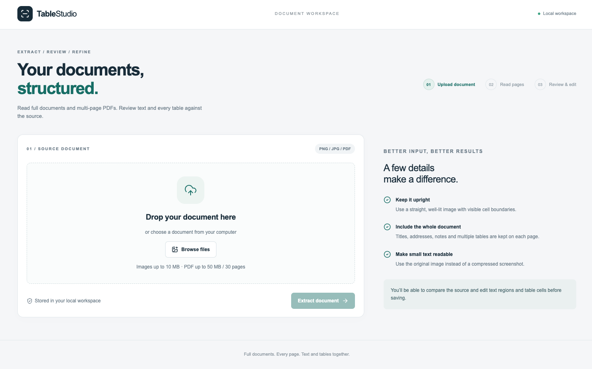
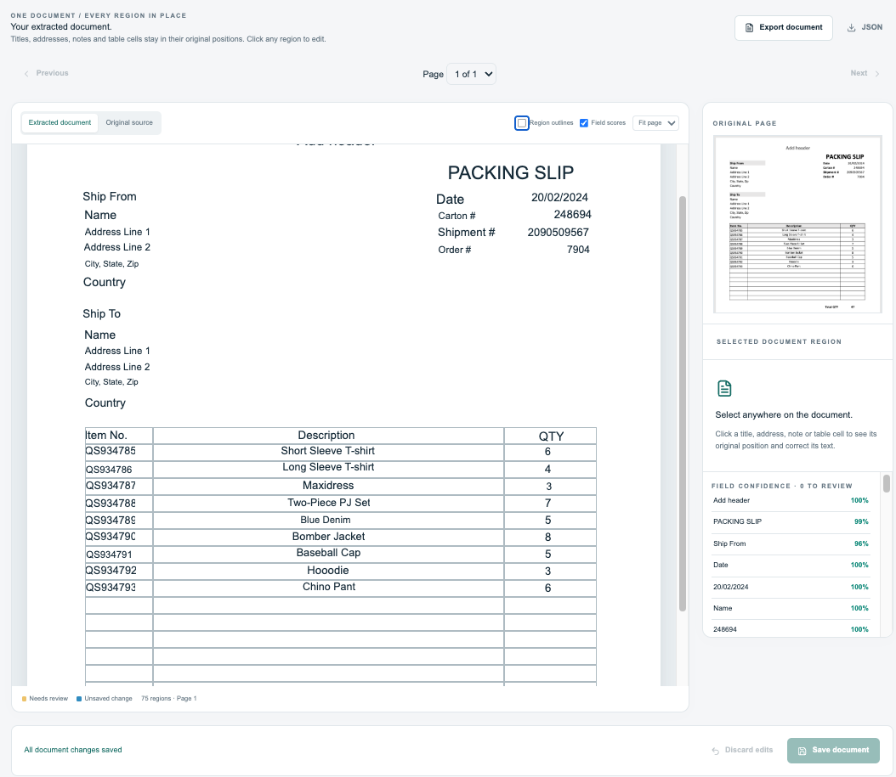
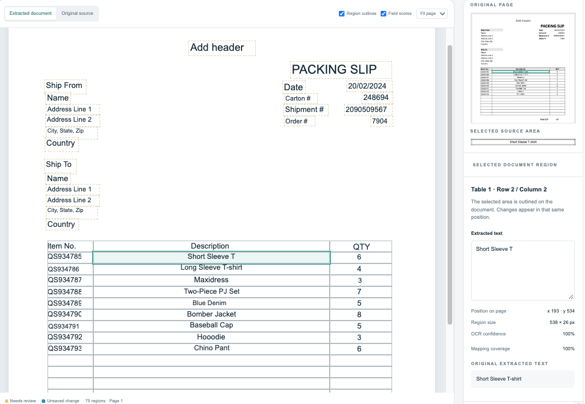
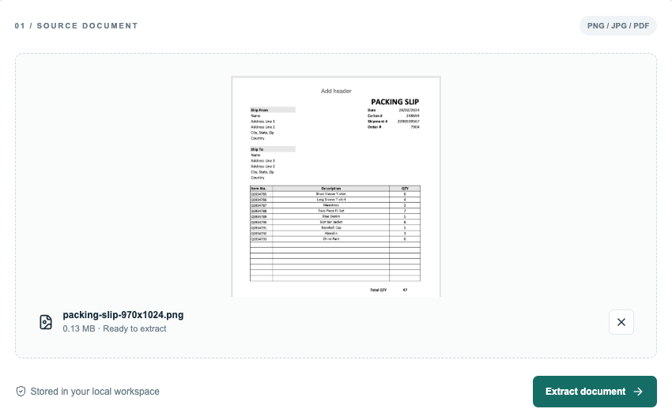
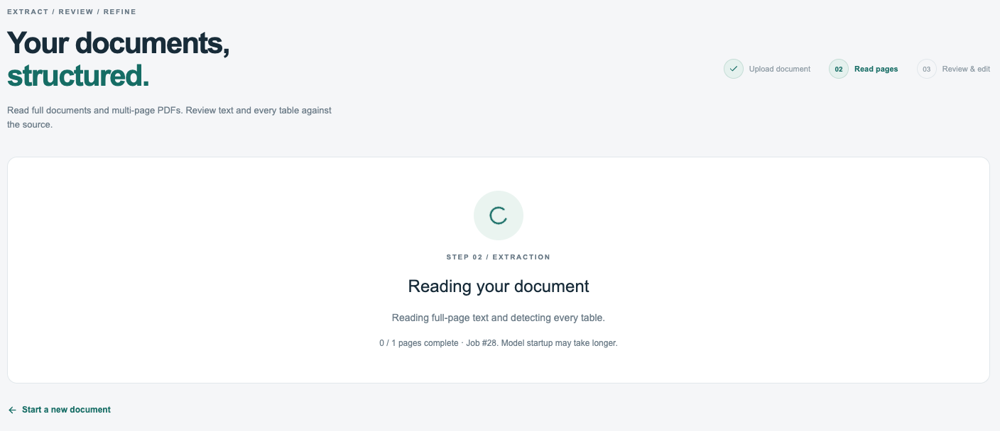
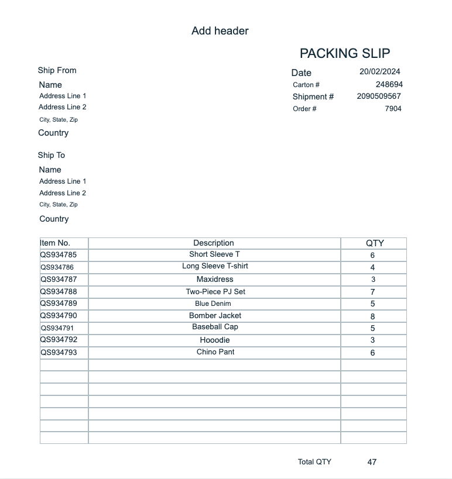
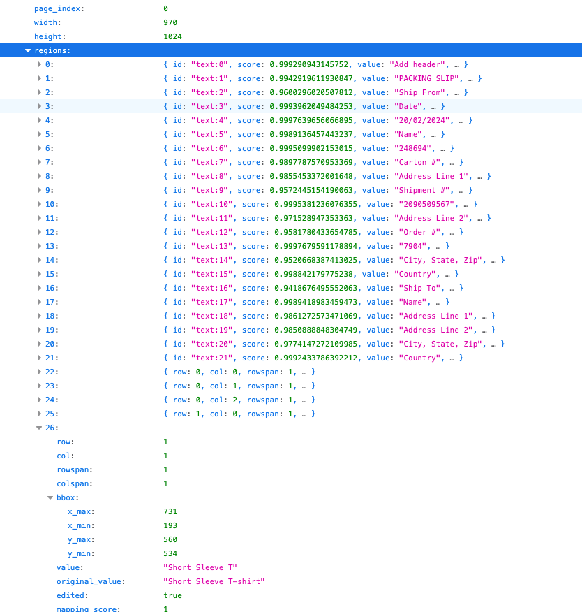

# OCR Document Processing Pipeline

An OCR app for reviewing PNG, JPEG and PDF documents in the browser. Text and
table cells stay in their original page positions, so you can compare the result
with the source and correct it without switching between separate forms.

The project runs locally with Docker Compose. Next.js provides the editor,
FastAPI handles uploads and edits, and a Celery worker runs PaddleOCR on the CPU.

## Preview

<p align="center">
  
  <br />
  <em>Main page — Select and upload an image or PDF.</em>
</p>
<br />

<p align="center">
  
  <br />
  <em>Result Page - Displays OCR result and confidence scores.</em>
</p>
<br />

<p align="center">
  
  <br />
  <em>Edit Result - Select inaccurate or low confidence field and edit.</em>
</p>
<br />

<details>
  <summary>More Screenshots</summary>

  <p align="center">
    
    <br />
    <em>Image Uploaded - Shows the uploaded original image.</em>
  </p>
  <br />

  <p align="center">
    
    <br />
    <em>Processing Page - User receives Job # and workers process OCR.</em>
  </p>
  <br />

  <p align="center">
    
    <br />
    <em>HTML Export - Exported HTML.</em>
  </p>
  <br />

  <p align="center">
    
    <br />
    <em>JSON Export - Exported JSON.</em>
  </p>
  <br />
</details>

## Features

- Extract page text and multiple tables, including merged cells and empty cells
  in tables with visible rules.
- Process PDFs one page at a time and show progress as each page finishes.
- Select a text region or table cell, inspect its source crop, and edit its value.
- Show OCR confidence, spatial mapping scores and extraction warnings for review.
- Save changes across pages while keeping the original OCR result.
- Export all pages as JSON or positioned HTML, including current unsaved edits.

PNG and JPEG uploads are limited to 10 MB and 25 million pixels. PDFs can contain
1–30 pages and must be 50 MB or smaller. Password-protected PDFs are not supported.

## Run locally

Start Docker Desktop. In a new checkout, copy the configuration template from
the project root:

```sh
cp .env.example .env
```

Set `POSTGRES_PASSWORD` in `.env` to your own local password, replacing `change-me`.
If `.env` already exists, edit it instead of copying the template over it. Then run:

```sh
docker compose up -d --build
```

Open [the document editor](http://localhost:3000). The API documentation is at
[localhost:8000/docs](http://localhost:8000/docs).

You do not need a local Python virtual environment or Node.js installation.
The first build installs dependencies, and the first worker start downloads the
OCR models. Model files are cached in Docker volumes for later starts.

Check model initialization with:

```sh
docker compose logs -f worker
```

With the default warmup setting, look for `Document OCR model ready` before
uploading a document. A healthy worker can answer Celery pings before the model
has finished loading.

OCR needs several gigabytes of memory. The worker is capped at 7 GB by default;
Docker Desktop also needs room for PostgreSQL, Redis and the application servers.
If the worker is killed during extraction, check the logs and Docker's memory
allocation before increasing OCR resolution or batch size.

Upload a document and wait for processing to finish. Click a region to edit it,
then use **Save document** to persist your changes. Draft edits survive page
navigation, but refreshing the browser loses unsaved changes and the current
job selection.

## Configuration

Compose requires `POSTGRES_PASSWORD`; the other settings have local defaults.
Keep the real password in the root `.env`, which Git ignores. The committed
root `.env.example` is the only configuration template and contains a placeholder.
Compose reports an error if no password is supplied. The root `.env` is the
only local configuration file; do not create `backend/.env` or `frontend/.env`.
It is excluded from Git and image builds. Compose builds the container database
and Redis addresses, passes settings to the API and worker, and supplies
`NEXT_PUBLIC_API_URL` when building the frontend.

For an existing database volume, use its current password. Changing `.env` alone
does not change the database user's password.

| Setting                          | Default                 | Purpose                                                                   |
| -------------------------------- | ----------------------- | ------------------------------------------------------------------------- |
| `POSTGRES_PASSWORD`              | Required                | Local database password; replace the template placeholder                 |
| `FRONTEND_PORT` / `BACKEND_PORT` | `3000` / `8000`         | Browser-facing ports                                                      |
| `POSTGRES_PORT` / `REDIS_PORT`   | `5432` / `63797`        | Local database and queue ports                                            |
| `NEXT_PUBLIC_API_URL`            | `http://localhost:8000` | API address used by the browser                                           |
| `OCR_LANGUAGE`                   | `korean`                | Recognition language; use `en` for English documents                      |
| `OCR_WARMUP`                     | `1`                     | Load the model after worker startup; `0` loads it on the first job        |
| `OCR_CPU_THREADS`                | `4`                     | CPU threads used by the model                                             |
| `OCR_RECOGNITION_BATCH_SIZE`     | `4`                     | Text crops recognized together                                            |
| `OCR_DETECTION_SIZE`             | `2048`                  | Maximum long side for text detection                                      |
| `OCR_DETECTION_MAX_PIXELS`       | `1000000`               | Pixel budget for the text detector                                        |
| `OCR_UPSCALE_TARGET`             | `1600`                  | Target long side for small inputs, with at most 2× upscaling              |
| `OCR_REFINE_MAX_CROPS`           | `64`                    | Maximum crops considered for targeted re-recognition                      |
| `OCR_WORKER_MEMORY_LIMIT`        | `7g`                    | Worker container memory limit                                             |
| `OCR_TASK_TIME_LIMIT`            | `5400`                  | Soft document timeout in seconds; the hard limit follows 60 seconds later |

After changing `.env`, run `docker compose up -d --build` again. The browser API
address is baked into the frontend build, so a restart alone will not update it.
If you change the backend port, update `NEXT_PUBLIC_API_URL` to match.

Higher detection limits and larger batches use more memory. The detector budget
does not resize the recognition source crops, but a lower budget can make very
small text harder to locate.

## How processing works

1. The API validates the file, saves it to `storage/uploads`, and creates a `Job`
   row in PostgreSQL.
2. It sends the job ID to Redis and returns immediately. The browser polls for
   progress; the upload response does not mean OCR has finished.
3. The Celery worker reads the file and processes its pages in order. It reuses
   one OCR model in its child process.
4. Each page is converted into text regions and table cells with coordinates.
   Clear table rules can repair cell geometry, and uncertain text matches are
   left available for review rather than forced into a cell.
5. The worker saves each completed page. When all pages finish, it marks the job
   as `done`. Edits are saved separately from the extracted result.

PDF pages with embedded text and no image objects use the stored text and
coordinates instead of full-page text OCR. Layout and table detection still run.
Pages containing images use OCR, then merge embedded text with OCR-only regions.

The worker uses one prefork child and replaces it after five Celery tasks to
release retained memory. Warmup counts as one task. A replacement child reloads
the model when needed. If a child is killed or hits its hard timeout, the parent
tries to record the job as failed.

## Project layout

```text
backend/
  main.py                   FastAPI app and database initialization
  src/api/v1/endpoints/     Upload, result, preview and edit endpoints
  src/models/               PostgreSQL table definitions
  src/core/                 Celery configuration
  src/services/             Document input, OCR, geometry, mapping and edits
  src/tasks/                Model reuse, job execution and interruption handling
  tests/                    Automated checks
frontend/
  app/                      Pages and styles
  components/ocr/           Upload and document editor
  hooks/                    Upload state and result polling
  lib/                      API types, requests and exports
docker-compose.yml          Local services and shared storage
.env.example                Compose configuration template
```

`requirements.docker.txt` defines the API dependencies. The worker adds
`requirements.ocr.txt` and CPU PaddlePaddle. The current OCR versions are
PaddleOCR 3.4.0, PaddleX 3.4.1 and PaddlePaddle 3.3.0. Small compatibility adapters
in `services/` depend on these versions, so check them when upgrading.

## Stored data

PostgreSQL stores job metadata and JSONB results. Uploaded files and PDF page
previews live in `./storage`, shared by the API and worker.

| Field         | Contents                                     |
| ------------- | -------------------------------------------- |
| `raw_json`    | Model output and preprocessing details       |
| `result_json` | Original extracted document, grouped by page |
| `edited_json` | Saved user edits applied to the document     |

Database, Redis and model caches use named Docker volumes. `docker compose down`
stops the stack without removing them. Adding `-v` deletes those volumes, including
the database and model cache; it does not remove the bind-mounted `./storage`.

For older database rows with absolute storage paths, `OCR_STORAGE_LEGACY_ROOT`
maps the old storage root to the container path when reading files. It does not
rewrite rows or move uploads.

## Development commands

```sh
docker compose ps
docker compose logs -f backend worker
docker compose up -d --build
docker compose restart worker
docker compose down
```

Run the backend tests inside Docker:

```sh
docker compose run --rm --no-deps worker python -m unittest discover -s tests -v
```

The tests cover uploads, PDF handling, table geometry, text mapping, edit
validation and interrupted workers. API tests use an isolated SQLite database
and a mocked queue. These checks do not measure OCR accuracy across real documents.

Frontend lint, TypeScript checks and the production build run with:

```sh
docker compose build frontend
```

## Current limitations

- Extraction still needs human review. Small text, faint rules, rotated scans and
  irregular layouts can produce missing or incorrect regions.
- Field mapping uses geometry. It does not identify business fields such as
  invoice number or shipper by their meaning. A mapping score measures overlap,
  not the probability that a value is correct.
- You can edit text values, but cannot manually redraw tables, add rows or change
  merged cells in the editor.
- A failed page leaves earlier completed pages in the database, but the browser
  shows the failed job rather than opening a partial-result editor.
- Child-process failure handling needs a live parent and database. A whole
  container or host failure can leave a job marked as `processing`.
- There is no job history screen, automatic resume, retry endpoint or edit
  version check for multiple users.
- The Compose setup is for local use. It binds ports to localhost and has no
  authentication, HTTPS or managed storage configuration.
